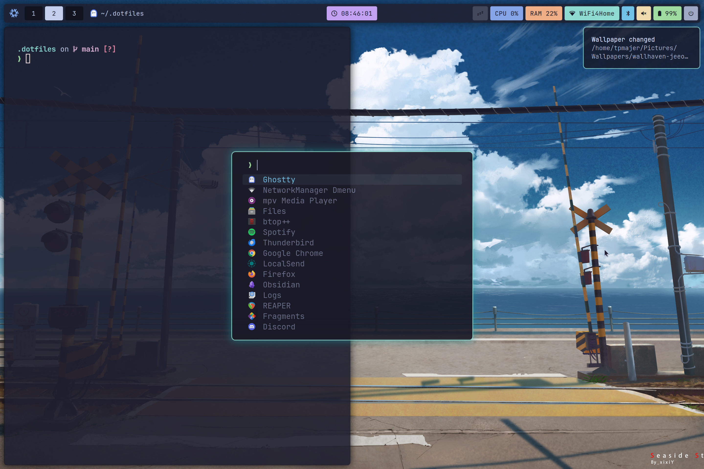

# dotfiles

Personal dotfiles for my daily Linux setup. Currently built around the [Catppuccin Mocha](https://catppuccin.com) color scheme, the [Niri](https://github.com/niri-wm/niri) scrolling compositor, and [Ghostty](https://ghostty.org) terminal.

Includes configuration for: [Niri](https://github.com/niri-wm/niri) · [Ghostty](https://ghostty.org) · [Fish](https://fishshell.com) · [Waybar](https://github.com/Alexays/Waybar) · [Fuzzel](https://codeberg.org/dnkl/fuzzel) · [Mako](https://github.com/emersion/mako) · [MPV](https://mpv.io) · [uosc](https://github.com/tomasklaen/uosc) · [btop](https://github.com/aristocratos/btop) · [bat](https://github.com/sharkdp/bat) · [fastfetch](https://github.com/fastfetch-cli/fastfetch) · [starship](https://starship.rs) · [wlogout](https://github.com/ArtsyMacaw/wlogout) · [hyprlock](https://github.com/hyprwm/hyprlock/)

#

#

Many of the configurations in this repository are inspired by or borrowed from the work of others in the community. There are too many sources to credit individually, but I'm grateful to everyone who shares their dotfiles publicly.

___
